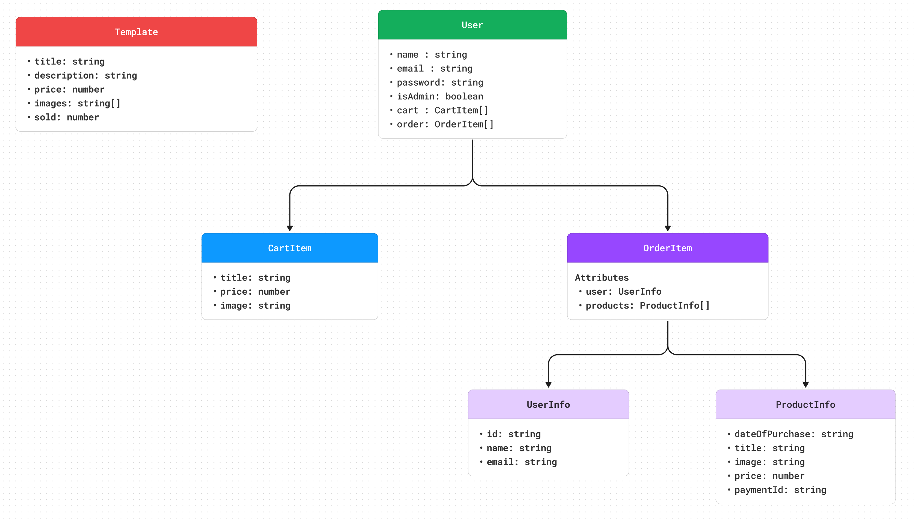
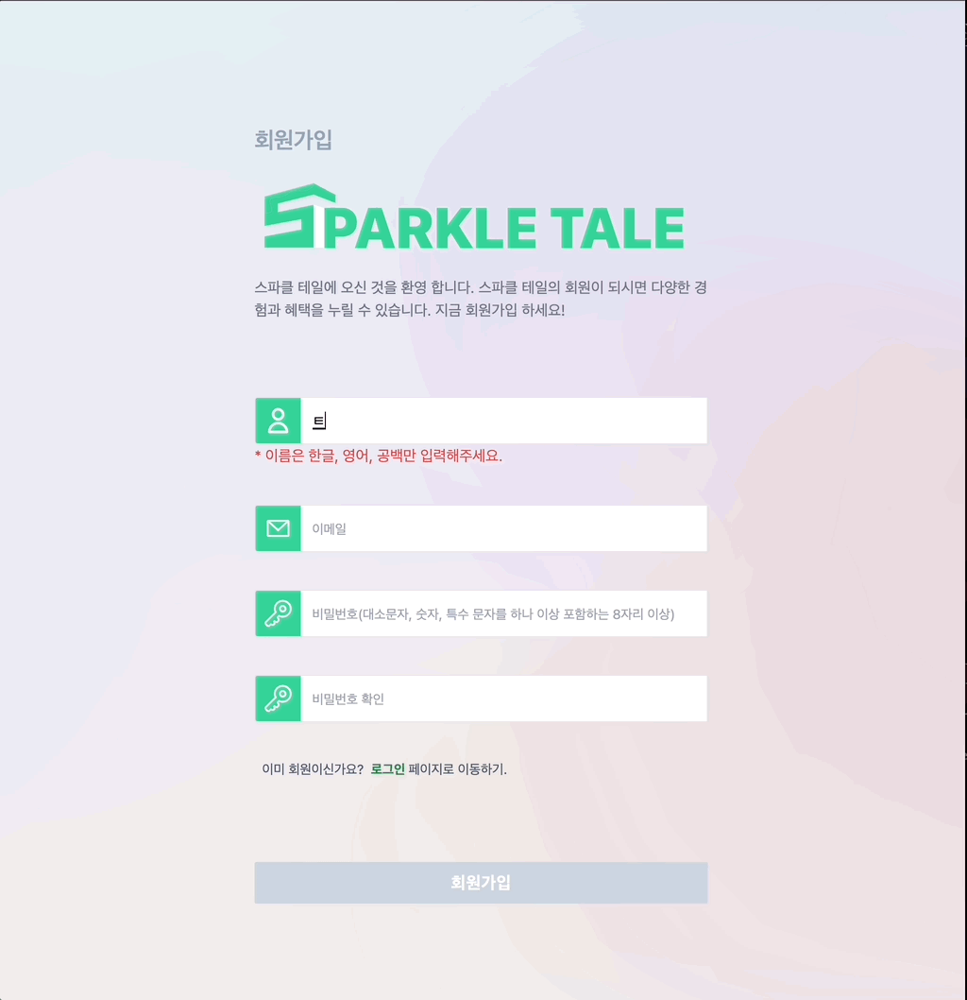
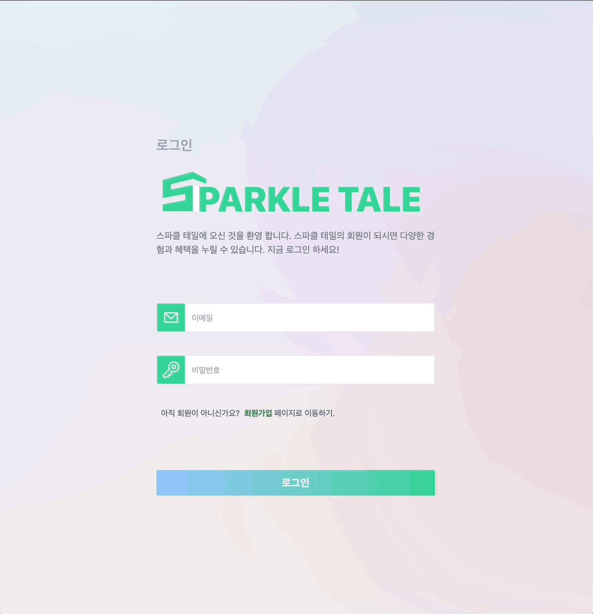
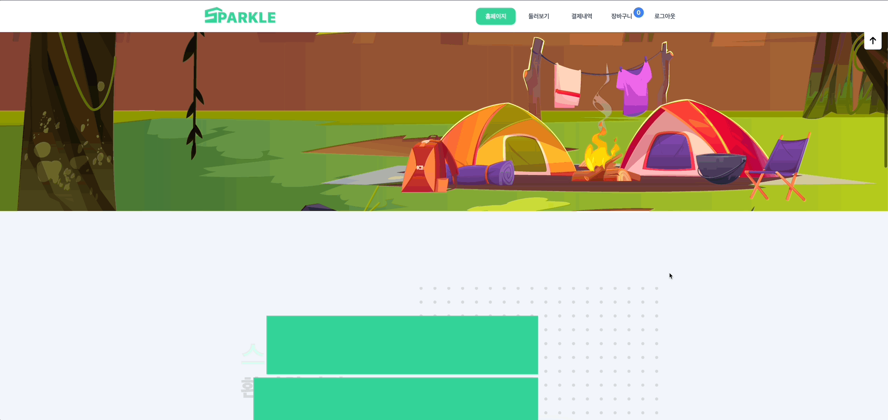
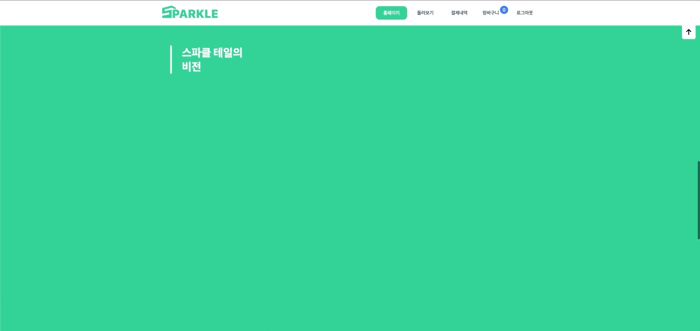
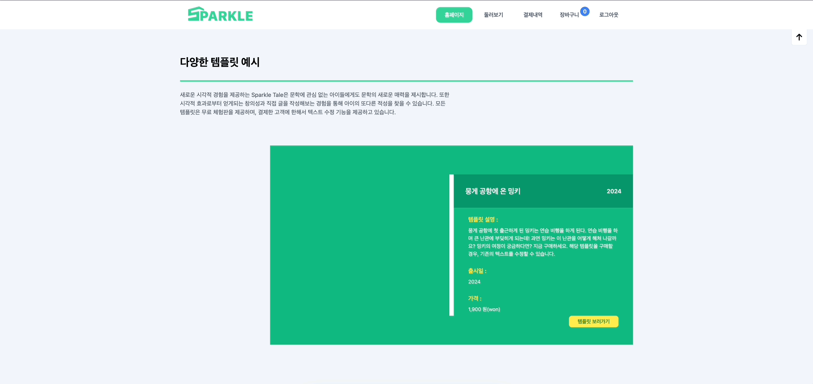

# Sparkle Tale : 다양한 3D 템플릿을 판매하는 쇼핑몰


<br/>

"여기 배너 사진"
- 배포 URL : <a href="">링크</a>
- 테스트용 계정 ID (관리자, admin) : Admin@test.com
- 테스트용 계정 PW : Admin123!
- Notion: <a href="https://www.notion.so/Sparkle-Tale-8e5300594dab4d6c915786526dfb2802">더 상세한 설명이 궁금하다면? 여기를 클릭해주세요.</a>


<br/><br/><br/>


## 목차

01. [프로젝트 설명](#01-프로젝트-설명)
02. [개발 환경](#02-개발-환경)
03. [폴더 구조](#03-폴더-구조)
04. [DB 스키마 설계](#04-db-스키마-설계)
05. [개발 기간](#05-개발-기간)
06. [페이지별 기능](#06-페이지별-기능)
<br><br><br>


## 01. 프로젝트 설명
#### 1-1 ) 프로젝트를 시작하게 된 이유
> 현대 사회에서 아이들이 식당이나 이동하는 차량에 테블릿과 휴대폰에 집착하는 모습을 흔하게 볼 수 있다. 이 현상을 비롯해 스파클 테일(Sparkle Tale)을 탄생시킨 아이디어는 "아이들이 이 시간을 좀 더 유의미하게 쓸 순 없을까?"라는 생각에서 출발한다. 아이들이 짜투리 시간에 책을 읽거나 공부를 하는 것이 베스트겠지만, 현실성 없는 대안이다. 당장 어른도 책 읽기 힘들어 하지 않는가. 그렇다면 아이들이 재밌어 하면서도 생산적인 활동을 할 수 있는 자료들을 제공하면 어떨까. 최종적으로 스파클 테일은 3D 모델을 직접 움직이며 동화책을 읽는 것 같은 템플릿을 제공하는 웹 사이트를 만들게 되었다. 

<br/>

#### 1-2 ) 프로젝트 특징
  - 3D 모델을 이용해서 직접 움직일 수 있는 주도권을 제공하면서 동화를 더욱 입체적으로 즐길 수 있게 했다. 
  - 주 사용자는 아이들이기 때문에 정적인 데이터도 다양한 효과를 통해 다채롭게 표현하려고 노력했다. 
  - UX/UI를 우선적으로 고려했으며, 명확하고 정확한 기능들을 제공하면서도 좋은 디자인으로 시각적인 즐거움도 제공하려고 노력했다. 
  - 풀스택으로 혼자 개발했다. 4월부터 진행될 팀 프로젝트 전에 개발의 전체적인 흐름을 잘 이해하고 싶어서 1인 개발을 하게 되었다.

<br><br><br>


## 02. 개발 환경
- Frontend: React, Typescript, Tailwind, React-query
- Backend: Node.js, Express, MongoDB
- 버전 관리 : Github


<br><br><br>


## 03. 폴더 구조 
```
Sparkle_Tale
├── 📂 frontend
│   ├── .env
│   ├── .gitgnore
│   ├── .eslintrc.cjs
│   ├── index.html
│   ├── tailwindcss.config.js
│   ├── tsconfig.json
│   ├── tsconfig.node.json
│   ├── vite.config.ts
│   ├── package-lock.json
│   ├── package.json
│   ├── 📂 public
│   │   ├── 📂 fonts
│   │   ├── 📂 images
│   │   ├── 📂 models
│   │   └── 📂 readme
│   │
│   └── 📂 src
│       ├── 📂 components
│       ├── 📂 context
│       ├── 📂 lib
│       ├── 📂 pages
│       ├── 📂 types
│       ├── 📂 utils
│       ├── App.tsx
│       ├── index.css
│       ├── main.tsx
│       └── vite-env.d.ts
│
├── 📂 backend
│   ├── .env
│   ├── .gitgnore
│   ├── package-lock.json
│   ├── package.json
│   ├── 📂 uploads
│   │
│   └── 📂 src
│       ├── 📂 middleware
│       │   └── auth.js
│       ├── 📂 models
│       │   ├── Payment.js
│       │   ├── Template.js
│       │   └── User.js
│       ├── 📂 routes
│       │   ├── template.js
│       │   └── users.js
│       └── index.js
│   
└── readme.md
```


<br><br><br>

## 04. DB 스키마 설계



<br><br><br>


## 05. 개발 기간
#### 개발 기간
- 전체 개발 기간 : 2024-02-14 ~ 2024-03-18
- 3D 템플릿 제작 : 2024-02-14 ~ 2024-02-19
- 프론트엔드 작업 : 2024-02-21 ~ 2024-03-17
- 백엔드 작업 : 2024-03-08 ~ 2024-03-16


<br><br><br>


## 06. 페이지별 기능

#### [ <span style="color: orange">회원가입</span> ]
- 프론트엔드
  - 이름, 이메일, 비밀번호, 비밀번호의 각 필드는 change 이벤트가 발생할 때마다 유효성 검사 진행
  - 유효성 검사를 통과하지 못하면 필드 밑에 경고문 표시
  - 모든 필드 유효성 검사를 통과 시 버튼이 활성화
  - 회원가입 버튼 클릭 시 회원가입 요청 API를 호출
  - 응답 값 200 : 성공했다는 알림창 + 로그인 페이지로 이동
  - 응답 값 500 : 중복 이메일을 사용했다는 알림창을 띄움
- 백엔드
  - DB에 유저 정보를 저장하기 전에 비밀번호는 bcrypt로 해시화
  - 해시화 한 비밀번호와 나머지 유저 정보를 DB의 User collection에 저장
  - 성공적으로 DB에 저장하면 status 200, 실패하면 status 500을 응답으로 반환

<br>


<br><br>


#### [ <span style="color: orange">로그인</span> ]
- 프론트엔드
  - 이메일만 유효성 검사 진행
  - 활성화 된 로그인 버튼을 누르면 유저 정보를 확인하는 API 호출
  - 응답 값 200 :  로그인 했다는 알림창 등장 + 홈페이지로 이동
  - 응답 값 500 : 로그인에 실패했다는 알림창만 등장
- 백엔드
  - 사용자가 입력한 이메일과 일치하는 이메일을 가진 유저가 있는지 DB의 user collection에서 찾고 있다면 해당 유저의 모든 정보를 가져옴.
  - 만약 해당 이메일에 일치하는 유저 정보가 없다면 status 500과 함께 함수 종료
  - 찾았다면, 해당 유저의 비밀번호와 사용자가 입력한 비밀번호가 일치하는 지 확인. 
  - 해시화 한 비밀번호는 원본으로 복구할 수 없기 때문에 bcrpyt의 compare 메서드를 통해 일치 여부 판별
  - 비밀번호가 일치하지 않으면 status 500과 함께 함수 종료
  - 비밀번호 일치하면 jsonwebtoken으로 12시간동안 유효한 토큰 생성 
  - 토큰까지 생성했다면 클라이언트에 status 200과 비밀번호를 제외한 유저의 모든 정보 그리고 토큰 정보를 응답으로 보낸다

<br>


<br><br>


#### [ <span style="color: orange">홈페이지</span> ]
- 크게 4개의 섹션으로 나뉜다.
- 배너 )
  - 아이들의 시각적 호기심을 자극하기 위해서 Parallax Scrolling 기술 사용
  - 스크롤 할 때마다 window.ScrollY 값을 추적해서 이미지들의 위치를 다르게 함
  - window.ScrollY 값에 따라 이미지 배치가 달라져서 애니메이션처럼 보이는 효과 구현

<br><br>

- 섹션 1 ) 
  - Sparkle Tale 짧은 소개
  - 특정 scrollY 값에 도달하면 텍스트가 등장하는 효과 구현

<br><br>

- 섹션 2 ) 
  - Sparkle Tale의 비전 소개
  - 특정 scrollY 값에 도달하면 카드 3개가 순차적으로 등장

<br><br>

- 섹션 3 ) 
  - 템플릿 예시 소개
  - 특정 scrollY 값에 도달하면 예시 이미지 등장

<br><br>


<br><br><br>

#### [ <span style="color: orange">상품 리스트 페이지</span> ]
- 프론트엔드
  - 사용자가 상품 리스트 페이지 방문 시 모든 템플릿 정보를 요청하는 API가 호출된다.
  - 응답을 받기 전까지는 pending 상태이며, pending 상태 동안은 "Loading . . ."을 출력한다.
  - 응답을 받은 경우 받은 데이터를 기반으로 UI를 렌더링
  - 상세 정보를 보지 않아도 특정 상품의 대략적인 정보를 알 수 있게 특정 템플릿 썸네일에 마우스를 올리면 배너 정보가 해당 상품의 정보로 바뀐다.
  - 배너의 더보기 버튼이나 썸네일 이미지를 클릭하면 해당 상품의 상세 페이지로 이동한다.
  - 관리자의 경우 새로운 템플릿 정보를 추가 할 수 있게 템플릿 생성 페이지로 이동하는 버튼을 만들었다.  
- 백엔드
  - 클라이언트로부터 요청을 받으면 template collection의 모든 데이터를 fetch해서 반환
  
<br><br>
