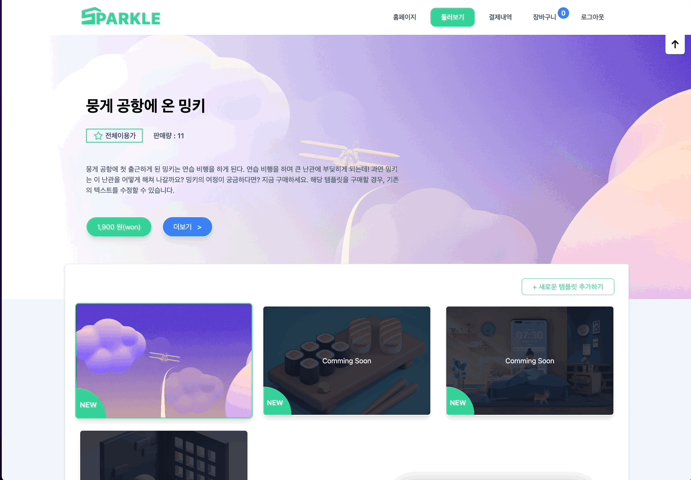
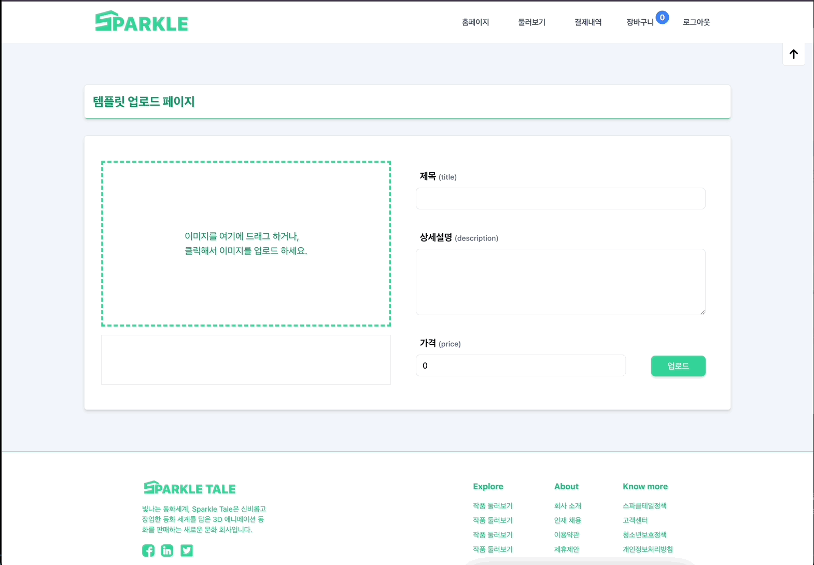
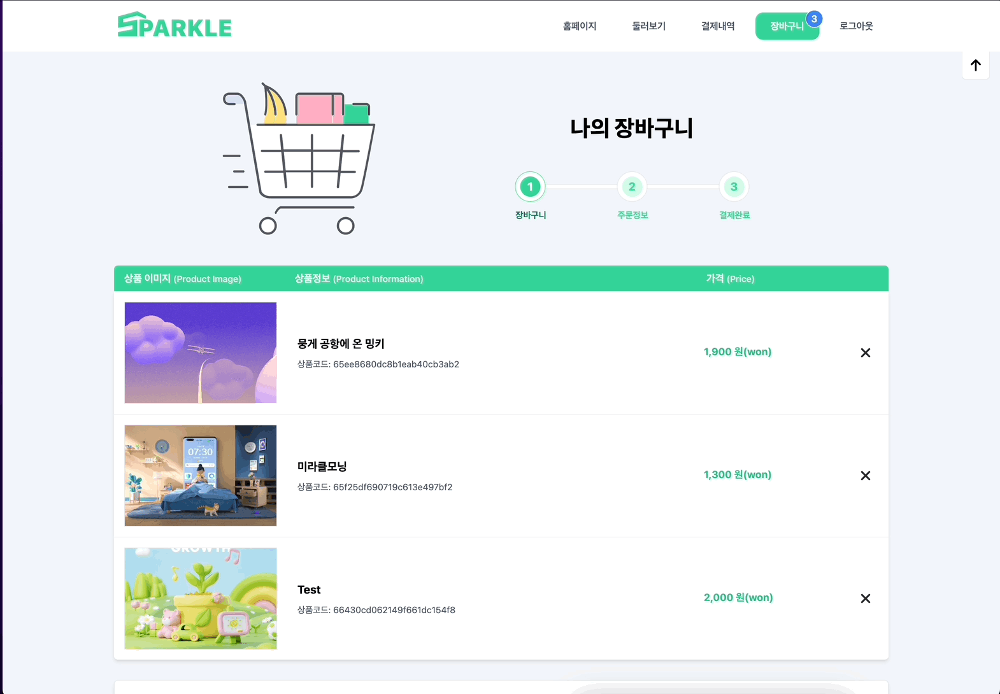
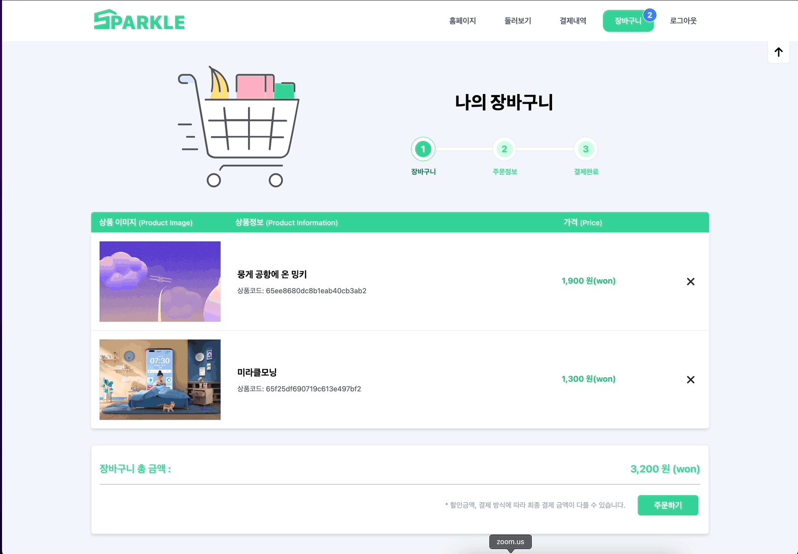
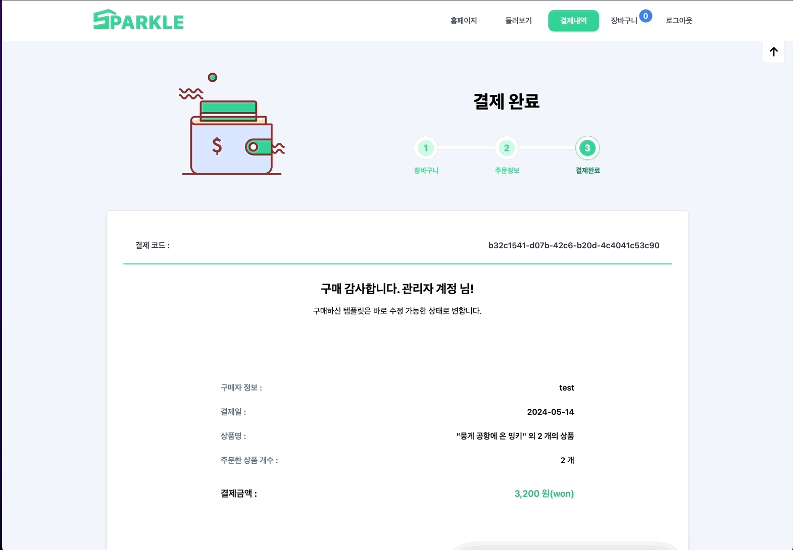

# Sparkle Tale : 3D 템플릿 판매 쇼핑몰

  

- 테스트 ID : Admin@test.com
- 테스트 PW : Admin123!

  

## 목차

01. [프로젝트 설명](#01-프로젝트-설명)
02. [기술 스택](#02-기술-스택)
03. [스키마 설계](#03-db-스키마-설계)
04. [개발 기간](#04-개발-기간)
05. [페이지별 기능](#05-페이지별-기능)
06. [프로젝트 후기](#06-프로젝트-후기)
   

## 01. 프로젝트 설명
#### 1-1 ) 프로젝트 개요
현대 사회에서 아이들이 식당이나 이동하는 차량에 테블릿과 휴대폰에 집착하는 모습을 흔하게 볼 수 있다. 이 현상을 비롯해 스파클 테일(Sparkle Tale)을 탄생시킨 아이디어는 "아이들이 이 시간을 좀 더 유의미하게 쓸 순 없을까?"라는 생각에서 출발한다. 아이들이 짜투리 시간에 책을 읽거나 공부를 하는 것이 베스트겠지만, 현실성 없는 대안이다. 당장 어른도 책 읽기 힘들어 하지 않는가. 그렇다면 아이들이 재밌어 하면서도 생산적인 활동을 할 수 있는 자료들을 제공하면 어떨까? 많은 고민 속에 3D 모델을 직접 조작하며 글도 읽을 수 있는 페이지를 판매하는 쇼핑몰 서비스를 제작했다.

 

#### 1-2 ) 프로젝트 특징
  - 3D 모델을 이용해서 직접 움직일 수 있는 주도권을 제공하면서 동화를 더욱 입체적으로 즐길 수 있게 했다. 
  - 주 사용자는 아이들이기 때문에 정적인 데이터도 다양한 효과를 통해 다채롭게 표현하려고 노력했다. 
  - UX/UI를 우선적으로 고려했으며, 명확하고 정확한 기능들을 제공하면서도 좋은 디자인으로 시각적인 즐거움도 제공하려고 노력했다. 
  - 풀스택으로 혼자 개발했다. 4월부터 진행될 팀 프로젝트 전에 개발의 전체적인 흐름을 잘 이해하고 싶어서 1인 개발을 하게 되었다.

   

## 02. 기술 스택

#### Language & Library & Framework
 

#### State management

#### Style

#### Database

   

## 03. DB 스키마 설계

   

## 04. 개발 기간
#### 개발 기간
- 전체 개발 기간 : 2024-02-14 ~ 2024-03-18
- 3D 템플릿 제작 : 2024-02-14 ~ 2024-02-19
- 프론트엔드 작업 : 2024-02-21 ~ 2024-03-17
- 백엔드 작업 : 2024-03-08 ~ 2024-03-16

   

## 05. 페이지별 기능

### [ 회원가입 ]
 
- 프론트엔드
  - 각 필드별 유효성 검사
  - 모든 필드 유효성 검사를 통과 시 버튼이 활성화
  - 회원가입 요청 API에 대한 응답에 따라 다른 알림창
    - 성공 시 status 200 반환, 성공했다는 알림창 + 로그인 페이지로 이동
    - 실패 시 status 500 반환, 중복 이메일을 사용했다는 알림창을 띄움
- 백엔드
  - DB에 유저 정보를 저장하기 전에 비밀번호는 bcrypt로 해시화
  - 해시화 한 비밀번호와 나머지 유저 정보를 DB의 User collection에 저장
  - 성공적으로 DB에 저장하면 status 200, 실패하면 status 500을 응답으로 반환

   

### [ 로그인 ]
 

- 프론트엔드
    - 이메일만 유효성 검사 진행
    - 로그인 요청 API 호출
    - 로그인 성공 )
      - 로그인 했다는 알림창 등장하며 홈페이지로 라우팅
      - 응답으로 받은 유저 정보를 Context API를 통해 전역 상태로 관리.
      - 이후 유저 권한 식별이 필요한 API 요청을 보낼 때,jwt로 암호화 된 토큰을 sessionStorage 저장한다. 이 토큰은 API 요청을 보낼 때마다 header에 넣어서 보냄
    - 로그인 실패 ) 
      - 로그인에 실패했다는 알림창만 등장

- 백엔드
  - 입력한 이메일과 일치하는 유저 정보 탐색. 없다면 status 500 반환
  - 찾았다면, DB에 저장된 비밀번호와 입력한 비밀번호가 일치하는지 검사. 일치하지 않으면 status 500 반환
  - 비밀번호 일치하면 12시간동안 유효한 jwt 생성
  - 응답으로 status 200, 비밀번호 제외 유저 정보, jwt를 보냄

  

### [ 홈페이지 ]
- 크게 4개의 섹션으로 나뉜다.
1. 배너 
  
  - 아이들의 시각적 호기심을 자극하기 위해서 Parallax Scrolling 기술 사용
  - 스크롤 할 때마다 window.ScrollY 값을 추적해서 이미지들의 위치를 다르게 함
  - window.ScrollY 값에 따라 이미지 배치가 달라져서 애니메이션처럼 보이는 효과 구현

  

2. 소개 섹션 : Sparkle Tale 짧은 소개
   

3. 비전 소개 섹션 : 특정 scrollY 값에 도달하면 카드 3개가 순차적으로 등장
   

4. 템플릿 소개 섹션 : 템플릿 예시 소개
   

   

### [ 템플릿 리스트 페이지 ]
  

- 프론트엔드
  - 페이지 방문 시 모든 템플릿 정보 요청 API 호출
  - 응답을 받기 전까지는 pending 상태이며, pending 상태 동안 "Loading . . ." 출력
  - 실제 조작 가능한 템플릿은 1개이므로 나머지는 Comming soon으로 구분
  - 템플릿 썸네일에 마우스를 올리면 배너 정보가 해당 상품의 정보로 변경
  - 관리자에게만 새로운 템플릿 정보 추가 버튼 & 기능 활성화  

- 백엔드
  - 클라이언트로부터 요청을 받으면 template collection의 모든 데이터를 반환

   

### [ 템플릿 정보 생성 페이지 ]
  

- 프론트엔드 
  - 이미지 업로드 시 서버의 uploads 파일에 이미지를 업로드
  - 업로드 버튼 시 템플릿 생성 요청 API 호출
- 백엔드
  - 템플릿 collection에 입력한 정보와 이미지(경로) 저장

   

### [ 메뉴바 ]
  
- 구성
  - 로고 : 클릭 시 홈페이지로 이동
  - 5가지 메뉴들 
    1. 홈페이지 : 클릭 시 홈페이지로 이동
    2. 둘러보기 : 클릭 시 상품 리스트 페이지로 이동
    3. 결제내역 : 클릭 시 결제 내역 상세 페이지로 이동
    4. 장바구니 : 현재 장바구니에 담긴 상품의 갯수를 보여주며, 클릭 시 장바구니 리스트 페이지로 이동
    5. 로그아웃 : 클릭 시 로그인 할 때 sessionStorage 저장했던 accessToken 값을 삭제하고 로그인 페이지로 라우팅

   

### [ 템플릿 상세 정보 페이지 ]
  
- 프론트엔드
  - 페이지 방문 시 해당 템플릿 정보 요청 API 호출
  - '지금 보기' 버튼 클릭 시 실제 템플릿 페이지로 라우팅
  - '카트에 담기' 버튼 클릭 시 장바구니 상품 추가 API 요청
  - 이미 장바구니에 있는 상품을 중복으로 담을 경우 알림창
  - 성공적으로 장바구니에 담았을 경우, 메뉴바의 장바구니 버튼 옆 숫자가 + 1 된다
 

- 백엔드
  - 장바구니 담기 요청 시, 템플릿이 이미 장바구니에 있는지 식별
  - 장바구니에 이미 있다면 status 500 반환
  - 장바구니에 없다면, 해당 유저의 cart 배열에 해당 템플릿의 id값을 넣고 status 200 반환 
  
   

### [ 실제 템플릿 페이지 ]
  
- 스크롤로 조작
- 일정 스크롤에 도달할 때마다 텍스트들이 등장

   

### [ 장바구니 페이지 ]
  

- 프론트엔드
  - 유저의 장바구니(cart)에 담긴 아이템의 총합 계산
  - 장바구니가 비어있는 경우, 상품 목록 대신 '아직 카트에 담긴 템플릿이 없습니다.'라는 텍스트 렌더링
  - 상품 리스트의 X 버튼 클릭 시 장바구니에서 상품 제외 요청 API 호출

- 백엔드
  -장바구니에서 상품 제외 요청을 받으면, 상품의 id값을 찾아서 유저의 cart 배열에서 제외
  - 성공 시, 응답값 200 반환
  - 실패 시, 응답값 500 반환 
  

   

### [ 주문 페이지 ]
  

- 프론트엔드
  - 사용자에게 이름, 연락처, 이메일 정보를 받음
  - 결제 동의에 체크 하고 결제 시, 결제 요청 API 호출
  - 실제로 결제는 안된다.
  - 결제 성공 시 장바구니를 비우고, 사용자의 결제 내역(order)에 결제 정보 추가 
- 백엔드
  - 결제 한 상품들의 정보와, 결제 정보를 유저 정보에 저장
  - 결제된 모든 상품들의 판매량(sold) 1씩 증가
  - 유저의 장바구니를 비운다

   

### [ 결제 내역 페이지 ]
  
- 유저가 결제한 상품들와 결제 당시 입력 정보 제공
- 제품 상세정보 버튼을 누르면 해당 상품 상세 정보 페이지로 라우팅

   

## 06. 프로젝트 후기
### 배운점
혼자 하는 개발이라 설계 부분에 시간을 거의 투자하지 않고 주제 선정 후 바로 개발을 시작했는데, 개발 후반부로 갈수록 다뤄야 할 데이터들이 많이 추가되면서 진행 속도가 많이 더뎌졌다. 설계 단계가 참 중요하다는 생각이 들었다. 

풀스택으로 이렇게 많은 페이지와 기능을 만든 것도 처음이고 마무리 한 것도 처음이었다. 프론트엔드 개발자는 프론트엔드만 잘 하면 될 것이라 생각했는데, 아니었다. 서버, 데이터베이스뿐만 아니라 CS에 대한 지식도 필요했다. 끊임 없이 문제에 부딪히며 부족한 부분을 인지하고 학습하는 과정에서 많이 배웠다. 

  

### 아쉬운점
추가적으로 구현하고 싶은 기능들이 있다. 첫번째는 템플릿 수정 기능이다. 만약 템플릿 구매자에 한해서 템플릿의 글을 수정할 수 있다면, 더 의미있는 서비스를 제공할 수 있을 것 같다. 두번째는 결제 기능이다. 결제 기능을 실제로 구현하지 못했다. 프로젝트 종료 후 찾아보니 페이팔에서 결제와 관련해서 제공하는 오픈 API가 있다던데, 공부해보면 좋을 것 같다. 

기능 이외에는 로딩에 관련한 UI 처리에 대한 아쉬움도 남았다. API 응답을 기다리는 동안 (pending 상태) 그냥 로딩 중이라는 텍스트를 출력했는데, 스켈레톤 UI를 사용했다면 UX적으로 훌륭한 작업물이 되었을 것 같다. 

마지막으로 아쉬웠던 것은 에러 핸들링 부분이었다. 서버에 문제가 있거나 로직에 문제가 있을 때, 에러를 throw하는데 이때 앱 전체가 다운된다. 다음 프로젝트에서는 에러 핸들링 부분을 신경써야 할 것 같다.